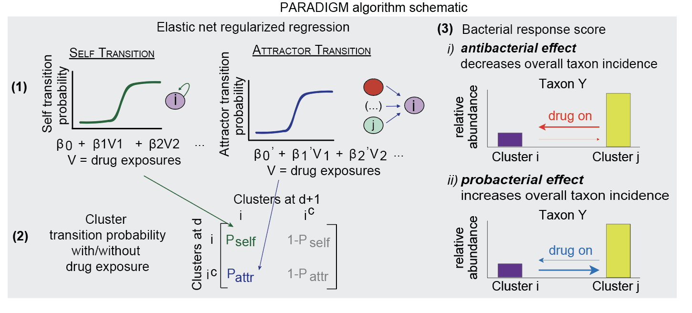

# PARADIGM: PARameters Associated with DynamIcs of Gut Microbiota

<!-- -->

This repository contains R scripts to reproduce the five figures in Chi et al., "High resolution analyses of associations between 
medications, microbiome and mortality in cancer patients". 

 - `R` folder contains the key script for PARADIGM algorithm. 
 - `RMD` folder contains the scripts to produce Figures 1-5 in the paper. 

## Data download 
Data can be downloaded from Figshare and saved to the `data` folder (which should be in the same folder as the GitHub repository `R` and `RMD` folders): 
 - https://doi.org/10.6084/m9.figshare.21657806.v1
 
## Data description

 1. `tblantibiotics_Duke.csv`: antibiotic exposure information for patients in the Duke cohort, between day -14 to 14 relative to HCT 
   - PatientID = deidentified patient IDs 
   - exposure_name = antibiotic name
   - exposure_day_relative_to_hct = date of exposure relative to HCT
   
 2. `tblattractor_coefficient_matrix_PARADIGM.csv`: raw attractor transition coefficient values from the PARADIGM algorithm, which indicates the associations between drug exposures with cluster attractor transition. This file is the output of `paradigm_example_Fig3_bc.RMD` script
   - Each row corresponds to a given cluster, each column corresponds to a parameter or the intercept 
   - day.x = time parameter (relative to HCT)
    
 3. `tblcounts.csv`: Taxonomic classification and ASV counts of samples in the entire study cohort
   - count = ASV counts
   - count_total = total ASV counts for a particular sampleid 
   - color = the hex color code for 16S data (used in `paradigm_example_Fig2.RMD` script) 
   - color_shotgun = the hex color code for shotgun metagenomic data (used in `paradigm_example_Fig2.RMD` script) 
 
 4. `tbldaily_sampling_PARADIGM.csv`: dataset of pairs of daily collected samples along with drug exposure records serving as input into the PARADIGM algorithm. This file is the input of `paradigm_example_Fig3_bc.RMD` script
   - PatientID = deidentified patient IDs 
   - sampleid.x = sample ID of the first sample in a pair of daily collected samples 
   - sampleid.xy = sample ID of the second sample in a pair of daily collected samples 
   - n10.x = kmeans cluster assignment of sampleid.x 
   - n10.y = kmeans cluster assignment of sampleid.y
   - day.x = day of collection relative to HCT of sampleid.x 
   - day.y = day of collection relative to HCT of sampleid.y
   - dday = numeric difference between day.x and day.y (should be 1 since we only consider daily collected sample pairs)
   - Subsequent columns correspond to a given drug exposure, with a value of `FALSE` if patients were NOT exposed to the drug on day.x, and a value of `TRUE` if patients were exposed to the drug on day.x
   
 5. `tbldrugs_MSKCC.csv`: drug exposure information for patients in the MSKCC cohort, between day -14 to 14 relative to HCT
   - PatientID = deidentified patient IDs 
   - exposure_name = drug name
   - exposure_day_relative_to_hct = date of exposure relative to HCT
  
 6. `tbleucliean_distance_10clusters_kmeans.csv`: a 10-by-10 matrix of pairwise cluster Euclidean distance metrics. Cluster distance is one of the parameters necessary to calculate cluster attractor transition probability. 
 
 7. `tblgraph_drug_exposure_classification.csv`: drug classification for graphing purposes
 
 8. `tblmeta_data.csv`: raw sequencing file release on NCBI SRA database 

 9. `tblpatient.csv`: patient characteristics for the entire study cohort
   - PatientID = deidentified patient IDs 
   - intensity = conditioning intensity 
   - simplesource = graft source 
   - disease_simple = underlying disease
   - ci = comorbidity index 
  
 10. `tblresponse_scores_4features_PARADIGM.csv`: response scores indicating the association between 62 investigated medications with 4 microbiome features of interest. This file is the output of `paradigm_example_Fig3_bc.RMD` script
   - Each row is a drug exposure, each column is a microbiome feature 
  
 11. `tblsample.csv`: sample characteristics for the entire study cohort
   - cluster_assignment = clusters identified by kmeans unsupervised clustering method 
   - Blautia, Enterococcus, Erysipelatoclostridium = relative abundance of each genus
   - tsne1, tsne2 = tSNE coordinates for 16S data (Fig. 1a, c)
   - tsne1_shotgun, tsne2_shotgun = tSNE coordinates for shotgun metagenomic data (Fig. 1b)
   
 12. `tblself_coefficient_matrix_PARADIGM.csv`: raw self transition coefficient values from the PARADIGM algorithm, which indicates the associations between drug exposures with cluster self transition. This file is the output of `paradigm_example_Fig3_bc.RMD` script
   - Each row corresponds to a given cluster, each column corresponds to a parameter or the intercept 
 
 13. `tblshotgun_MetaPhlAn.csv`: taxonomic classification and abundance by MetaPhlAn on shotgun metagenomic samples
 
 14. `tblstrain_dynamics.csv`: phylogenetic distance of dominant strains across longitudinal sample. This file is the input of `pradigm_example_Fig4.RMD` script
 
   - PatientID = deidentified patient IDs 
   - sampleid.x = sample ID of the first sample in a pair of subsequently collected samples 
   - sampleid.xy = sample ID of the second sample in a pair of subsequently collected samples 
   - day.x = day of collection relative to HCT of sampleid.x 
   - day.y = day of collection relative to HCT of sampleid.y
   - dday = numeric difference between day.x and day.y
   - genus = relative abundance of the genus encompassing species in column "strain_name" in sampleid.x 
   - species = relative abundance of the species in column "strain_name" in sampleid.x 
   - phylo_dist = phylogenetic distance of the dominant strains in sampelid.x and in sampleid.y within the species in "strain_name"
   - Subsequent columns correspond to a given drug exposure, with a value of `FALSE` if patients were NOT exposed to the drug between day.x and day.y, and a value of `TRUE` if patients were exposed to the drug between day.x and day.y. 
 
## R dependencies
 
R dependencies are stored in the  `renv.lock` file; to use this, run `renv::restore()` in this repository.
