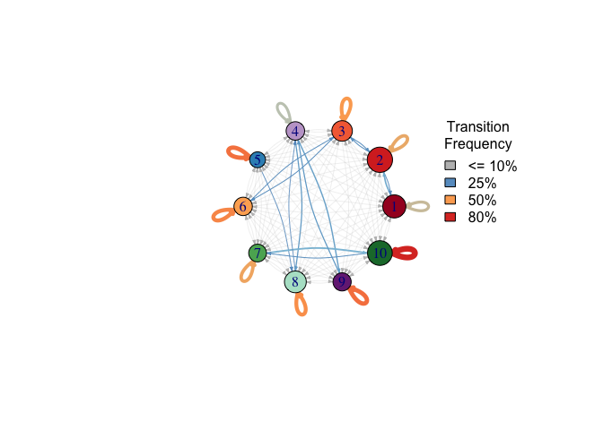
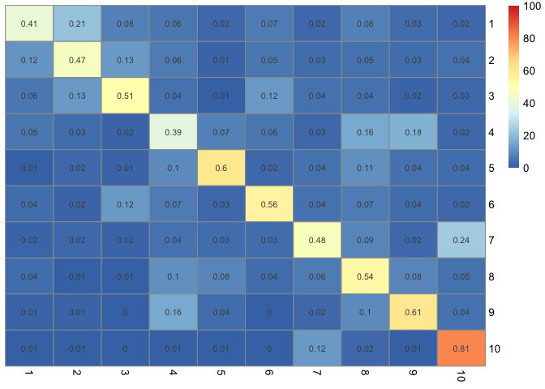

Cohort characteristics are outlined in 'tblsample' table.


```r
tblsample = read.csv("../../data/tblsample.csv")

table(tblsample$set)
```

```
## 
##       discovery      validation validation_Duke 
##            7454            1713             473
```

We created sample-pair-wise table for patients with longitudinal sampling in the MSKCC discovery cohort. 


```r
cluster_on_t_end <- function(taxonomic_table){
  return(cbind.data.frame(oligos_id = taxonomic_table$oligos_id, subsequent_cluster = c(taxonomic_table$cluster_assignment[-1],NA), 
                          day.y = c(taxonomic_table$day_relative_to_hct[-1],NA)) )
}

subsequent_cluster = tblsample %>%
  filter(set == "discovery") %>% 
  arrange(PatientID) %>% 
  arrange(day_relative_to_hct) %>% 
  group_split(PatientID) %>%
  map_dfr(~cluster_on_t_end(.))
head(subsequent_cluster)
```

```
##        oligos_id subsequent_cluster day.y
## 1 1000A..pool483                  4    -4
## 2 1000B..pool483                  5     6
## 3 1000C..pool483                  5     9
## 4 1000D..pool483                  5    13
## 5 1000E..pool483                 NA    NA
## 6 1002B..pool483                  5     3
```

```r
pairing_samples = tblsample %>% 
  left_join(subsequent_cluster, by = "oligos_id") %>% 
  filter(!is.na(subsequent_cluster)) %>% 
  mutate(dday = day.y - day_relative_to_hct) %>% 
  filter(dday <= 7) %>% 
  filter(set == "discovery")
head(pairing_samples)
```

```
##   sampleid      oligos_id PatientID cluster_assignment day_relative_to_hct
## 1    1000A 1000A..pool483      1000                  2                  -9
## 2    1000C 1000C..pool483      1000                  5                   6
## 3    1000D 1000D..pool483      1000                  5                   9
## 4    1002B 1002B..pool483      1002                  1                  -1
## 5    1002C 1002C..pool483      1002                  5                   3
## 6    1004A 1004A..pool483  FMT.0002                  1                 -10
##         set simpson_reciprocal     Blautia Enterococcus Erysipelatoclostridium
## 1 discovery           13.38430 0.406969925  0.000000000            0.005193935
## 2 discovery            2.08790 0.000000000  0.001073784            0.000000000
## 3 discovery            2.39139 0.001466583  0.001780851            0.000000000
## 4 discovery            5.38780 0.112959720  0.000000000            0.071706558
## 5 discovery            5.15961 0.005445227  0.156630365            0.000000000
## 6 discovery            9.71336 0.114697162  0.000000000            0.061245235
##   institution     tsne1      tsne2 shotgun_available tsne1_shotgun
## 1       MSKCC -0.746297 -0.0408929                no            NA
## 2       MSKCC  0.207460  0.4915400                no            NA
## 3       MSKCC  0.244664  0.2800610               yes    -0.7709889
## 4       MSKCC -0.475266 -0.1420040                no            NA
## 5       MSKCC  0.359112  0.3055980                no            NA
## 6       MSKCC -0.516421 -0.3004220                no            NA
##   tsne2_shotgun subsequent_cluster day.y dday
## 1            NA                  4    -4    5
## 2            NA                  5     9    3
## 3     -0.351067                  5    13    4
## 4            NA                  5     3    4
## 5            NA                  7     7    4
## 6            NA                  3    -3    7
```

```r
dim(pairing_samples)
```

```
## [1] 5482   19
```

```r
length(unique(pairing_samples$PatientID))
```

```
## [1] 677
```

```r
range(c(pairing_samples$day_relative_to_hct, pairing_samples$day.y) )
```

```
## [1]  -16 1084
```

We then calculated the cluster transition frequency among subsequently collected samples. 


```r
transition_matrix = table(pairing_samples$cluster_assignment, pairing_samples$subsequent_cluster)
transition_matrix = transition_matrix/rowSums(transition_matrix)
transition_matrix
```

```
##     
##                1           2           3           4           5           6
##   1  0.411382114 0.211382114 0.079674797 0.056910569 0.021138211 0.066666667
##   2  0.116603295 0.468948035 0.126742712 0.064638783 0.012674271 0.051964512
##   3  0.056530214 0.126705653 0.510721248 0.042884990 0.009746589 0.124756335
##   4  0.051867220 0.031120332 0.016597510 0.385892116 0.072614108 0.056016598
##   5  0.009345794 0.021806854 0.012461059 0.096573209 0.604361371 0.021806854
##   6  0.039560440 0.015384615 0.120879121 0.068131868 0.028571429 0.556043956
##   7  0.019753086 0.024691358 0.017283951 0.041975309 0.034567901 0.034567901
##   8  0.038585209 0.008038585 0.008038585 0.101286174 0.080385852 0.035369775
##   9  0.012793177 0.014925373 0.000000000 0.155650320 0.038379531 0.002132196
##   10 0.006165228 0.009864365 0.001233046 0.006165228 0.009864365 0.004932182
##     
##                7           8           9          10
##   1  0.021138211 0.076422764 0.032520325 0.022764228
##   2  0.034220532 0.049429658 0.034220532 0.040557668
##   3  0.040935673 0.042884990 0.017543860 0.027290448
##   4  0.026970954 0.157676349 0.178423237 0.022821577
##   5  0.043613707 0.109034268 0.043613707 0.037383178
##   6  0.041758242 0.068131868 0.037362637 0.024175824
##   7  0.479012346 0.088888889 0.022222222 0.237037037
##   8  0.062700965 0.535369775 0.080385852 0.049839228
##   9  0.023454158 0.098081023 0.609808102 0.044776119
##   10 0.120838471 0.023427867 0.008631319 0.808877928
```

We could visualize cluster transitions in a network map. 


```r
colors_asv_beta <- c("#A50026","#D73027","#F46D43","#C2A5CF","#3690C0",
                     "#FDAE61","#5AAE61","#B3E2CD","#762A83","#1B7837")

g <- graph.adjacency(transition_matrix, mode="directed", weighted=TRUE)
val2rgb <- colorRamp(rev(RColorBrewer::brewer.pal(11, "RdYlBu")[c(1:4,8:10)]), bias = 1)
size = table(tblsample$cluster_assignment[tblsample$set == "discovery"])
edge.curve = c(0.15)
layout <- matrix(c(1,5, -0.5,2, 1.5,1.5, 0.55,0.3, 2,0.65, 3,1, 3,2, 3,3, 6,6, 7,7), nrow=10, ncol=2, byrow=T)

edge.colored = rep(NA, 100)
edge.colored[which(E(g)$weight < 0.1)] <- 'grey'
edge.colored[which(E(g)$weight >= 0.1)] <- rgb(val2rgb(E(g)$weight[which(E(g)$weight >= 0.1)]) / 255)

edge.widthed = rep(NA,100)
edge.widthed[which(edge.colored == "grey")] <- 0.2
edge.widthed[which(is.na(edge.widthed))] <- E(g)$weight[which(is.na(edge.widthed))] * 8

plot.igraph(
  x               = g,
  xlim            = c(-1.5, 1.5),
  ylim            = c(-1.5, 1.5),
  layout          = layout_in_circle,
  vertex.size     = sqrt(size), vertex.color = colors_asv_beta, edge.arrow.size = 0.25,
  edge.width      = edge.widthed,
  edge.color      = edge.colored,
  edge.curved     = edge.curve, 
  edge.loop.angle = scales::rescale(seq_along(E(g)), to=c(0, -2 * 3.14)) )

legend(
  x      = 1.5, 
  y      = 1, 
  fill   = c("grey", "#679DC9", "#FDAB60", "#DC3A2C"), 
  legend = c("<= 10%", "25%", "50%", "80%"), 
  title  = "Transition\nFrequency", 
  bty    = "n" )
```

<!-- -->

We could also visualize cluster transitions in a 10x10 heatmap. 


```r
pheatmap((transition_matrix*100),cluster_rows= FALSE, cluster_cols = FALSE,
         display_numbers = round(transition_matrix,2), breaks = seq(0,100,by=1))
```

<!-- -->
