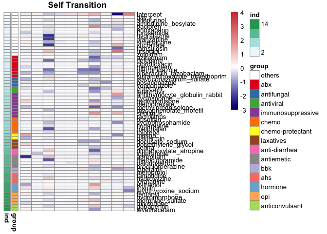
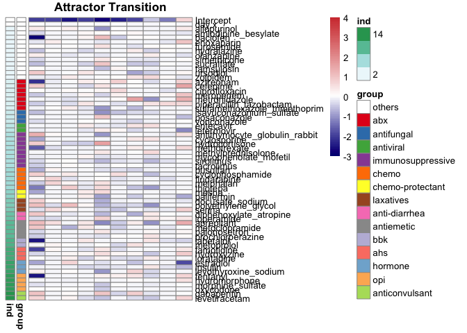
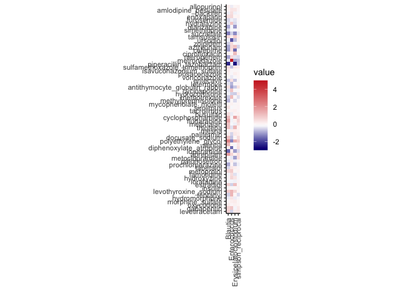
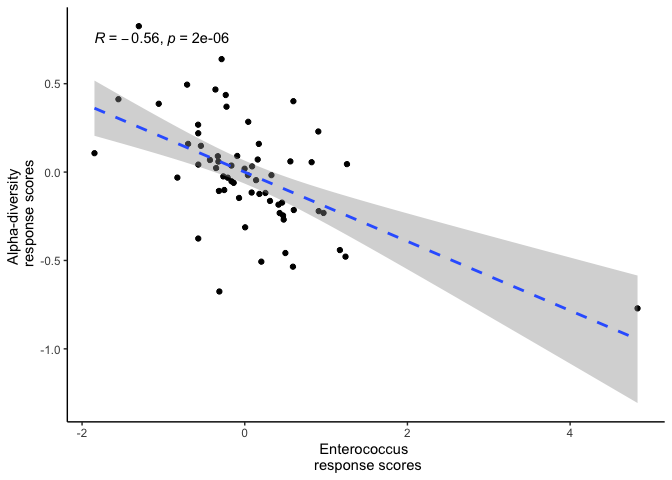

Source script runs elastic net regularized regression to learn the coefficients of each drug exposure to cluster self and attractor transitions, then convert cluster-drug associations into drug-taxon response scores. 

Table details: 
'tbldaily' Training data of microbiome cluster dynamics.
'tblpatient' Patient characteristics.
'tbleuclidean_distance' A 10x10 matrix of pair-wise cluster euclidean distance.
'tblcounts' Counts and taxonomic classifications of ASVs.
'tblsample' Sample characteristics. 


```r
tbldaily = read.csv("~/Desktop/Backup from server /backup_Oct2020/First rotation - VDB/Data - ASV/Sept7_rebuttal/deposited dataset/tbldaily_sampling_PARADIGM_input_101122.csv")
head(tbldaily)
```

```
##   PatientID sampleid.x sampleid.y n10.x n10.y day.x day.y dday allopurinol
## 1      1648      1648A      1648B     3     2    -3    -2    1       FALSE
## 2      1648      1648B      1648C     2     3    -2    -1    1       FALSE
## 3      1648      1648C      1648D     3     6    -1     0    1       FALSE
## 4      1648      1648D      1648E     6     6     0     1    1       FALSE
## 5  FMT.0251  FMT.0251A  FMT.0251B     2     1    -1     0    1       FALSE
## 6  FMT.0251  FMT.0251C  FMT.0251D     1     1     3     4    1       FALSE
##   amlodipine_besylate antithymocyte_globulin_rabbit aprepitant aztreonam
## 1               FALSE                         FALSE      FALSE     FALSE
## 2               FALSE                         FALSE      FALSE     FALSE
## 3               FALSE                         FALSE      FALSE     FALSE
## 4               FALSE                         FALSE      FALSE     FALSE
## 5               FALSE                         FALSE      FALSE     FALSE
## 6               FALSE                         FALSE      FALSE     FALSE
##   baclofen busulfan cefepime ciprofloxacin cyclophosphamide cyclosporine
## 1    FALSE    FALSE    FALSE         FALSE            FALSE        FALSE
## 2    FALSE    FALSE    FALSE          TRUE            FALSE        FALSE
## 3    FALSE    FALSE    FALSE          TRUE            FALSE        FALSE
## 4    FALSE    FALSE    FALSE          TRUE            FALSE        FALSE
## 5    FALSE    FALSE    FALSE          TRUE            FALSE        FALSE
## 6    FALSE    FALSE    FALSE         FALSE             TRUE        FALSE
##   diphenoxylate_atropine docusate_sodium enoxaparin entecavir estradiol
## 1                  FALSE           FALSE      FALSE     FALSE     FALSE
## 2                  FALSE           FALSE      FALSE     FALSE     FALSE
## 3                  FALSE           FALSE      FALSE     FALSE     FALSE
## 4                  FALSE           FALSE      FALSE     FALSE     FALSE
## 5                  FALSE           FALSE      FALSE     FALSE     FALSE
## 6                  FALSE           FALSE      FALSE     FALSE     FALSE
##   famotidine fentanyl fludarabine furosemide gabapentin hydralazine
## 1      FALSE    FALSE        TRUE      FALSE      FALSE       FALSE
## 2      FALSE    FALSE        TRUE      FALSE      FALSE       FALSE
## 3      FALSE    FALSE       FALSE      FALSE      FALSE       FALSE
## 4      FALSE    FALSE       FALSE      FALSE      FALSE        TRUE
## 5      FALSE    FALSE       FALSE      FALSE      FALSE       FALSE
## 6      FALSE    FALSE       FALSE       TRUE      FALSE       FALSE
##   hydrocortisone hydromorphone hydroxyzine insulin isavuconazonium_sulfate
## 1          FALSE         FALSE       FALSE   FALSE                   FALSE
## 2          FALSE         FALSE       FALSE   FALSE                   FALSE
## 3          FALSE         FALSE       FALSE   FALSE                   FALSE
## 4          FALSE         FALSE       FALSE   FALSE                   FALSE
## 5          FALSE         FALSE       FALSE   FALSE                   FALSE
## 6          FALSE         FALSE       FALSE   FALSE                   FALSE
##   labetalol letermovir levetiracetam levothyroxine_sodium loperamide loratadine
## 1     FALSE      FALSE          TRUE                FALSE      FALSE      FALSE
## 2     FALSE      FALSE         FALSE                FALSE      FALSE      FALSE
## 3     FALSE      FALSE         FALSE                FALSE      FALSE      FALSE
## 4     FALSE      FALSE         FALSE                FALSE      FALSE      FALSE
## 5     FALSE      FALSE         FALSE                 TRUE      FALSE      FALSE
## 6     FALSE      FALSE         FALSE                 TRUE       TRUE      FALSE
##   melphalan meropenem mesna methotrexate methylprednisolone metoclopramide
## 1     FALSE     FALSE FALSE        FALSE              FALSE          FALSE
## 2     FALSE     FALSE FALSE        FALSE              FALSE          FALSE
## 3     FALSE     FALSE FALSE        FALSE              FALSE          FALSE
## 4     FALSE     FALSE FALSE        FALSE              FALSE          FALSE
## 5     FALSE     FALSE FALSE        FALSE              FALSE          FALSE
## 6     FALSE     FALSE  TRUE        FALSE              FALSE          FALSE
##   metoprolol metronidazole morphine_sulfate mycophenolate_mofetile olanzapine
## 1      FALSE         FALSE            FALSE                  FALSE      FALSE
## 2      FALSE         FALSE            FALSE                  FALSE      FALSE
## 3      FALSE         FALSE            FALSE                  FALSE      FALSE
## 4      FALSE         FALSE            FALSE                  FALSE      FALSE
## 5       TRUE         FALSE            FALSE                  FALSE      FALSE
## 6       TRUE         FALSE            FALSE                  FALSE      FALSE
##   oxycodone palifermin palonosetron piperacillin_tazobactam polyethylene_glycol
## 1     FALSE      FALSE        FALSE                   FALSE               FALSE
## 2     FALSE      FALSE         TRUE                   FALSE               FALSE
## 3     FALSE      FALSE        FALSE                   FALSE               FALSE
## 4     FALSE      FALSE         TRUE                   FALSE               FALSE
## 5     FALSE      FALSE        FALSE                   FALSE               FALSE
## 6     FALSE      FALSE         TRUE                    TRUE               FALSE
##   posaconazole prochlorperazine senna simethicone sirolimus sucralfate
## 1        FALSE             TRUE FALSE       FALSE     FALSE      FALSE
## 2        FALSE             TRUE FALSE       FALSE     FALSE      FALSE
## 3        FALSE             TRUE FALSE       FALSE     FALSE      FALSE
## 4        FALSE             TRUE FALSE       FALSE     FALSE      FALSE
## 5        FALSE            FALSE FALSE       FALSE     FALSE      FALSE
## 6        FALSE            FALSE FALSE       FALSE     FALSE      FALSE
##   sulfamethoxazole_trimethoprim tacrolimus tamsulosin thiotepa ursodiol
## 1                         FALSE       TRUE      FALSE    FALSE     TRUE
## 2                         FALSE       TRUE      FALSE    FALSE     TRUE
## 3                         FALSE       TRUE      FALSE    FALSE     TRUE
## 4                         FALSE       TRUE      FALSE    FALSE     TRUE
## 5                         FALSE      FALSE      FALSE    FALSE     TRUE
## 6                         FALSE      FALSE      FALSE    FALSE     TRUE
##   voriconazole zolpidem
## 1        FALSE    FALSE
## 2        FALSE    FALSE
## 3        FALSE    FALSE
## 4        FALSE    FALSE
## 5        FALSE    FALSE
## 6        FALSE    FALSE
```

```r
tblpatient = read.csv("~/Desktop/Backup from server /backup_Oct2020/First rotation - VDB/Data - ASV/Sept7_rebuttal/deposited dataset/tblpatient_cohort_characteristics_master_table_deid_MSKCC_1227_Duke_142.csv")
head(tblpatient)
```

```
##   PatientID sex         intensity         simplesource disease_simple ci
## 1  FMT.0049   M          Ablative      PBSC unmodified       Leukemia  5
## 2  FMT.0054   M Reduced Intensity      PBSC unmodified         others  3
## 3       576   M       Nonablative      PBSC unmodified         others  7
## 4       484   M          Ablative PBSC T-cell Depleted       Leukemia  3
## 5      1010   M Reduced Intensity      PBSC unmodified       Leukemia  1
## 6       799   M Reduced Intensity      PBSC unmodified       Leukemia  4
##   age_range institution        set
## 1      >=65       MSKCC validation
## 2      >=65       MSKCC  discovery
## 3      >=65       MSKCC validation
## 4      >=65       MSKCC  discovery
## 5      >=65       MSKCC validation
## 6      >=65       MSKCC validation
```

```r
tbleuclidean_distance = read.csv("~/Desktop/Backup from server /backup_Oct2020/First rotation - VDB/Data - ASV/Sept7_rebuttal/deposited dataset/tbleuclidean_distance_10clusters.csv")
head(tbleuclidean_distance)
```

```
##          V1        V2        V3       V4       V5       V6       V7       V8
## 1  0.000000  7.514492 10.884100 13.66891 15.64003 11.45213 19.68835 12.32187
## 2  7.514492  0.000000  7.769842 16.76090 19.87182 13.99943 21.90538 18.10569
## 3 10.884100  7.769842  0.000000 18.81081 21.86847 10.18149 23.22660 20.45222
## 4 13.668907 16.760898 18.810814  0.00000 12.37217 14.64853 17.43152 11.47204
## 5 15.640029 19.871818 21.868473 12.37217  0.00000 16.73990 18.67581 10.76318
## 6 11.452135 13.999429 10.181488 14.64853 16.73990  0.00000 19.72279 14.59484
##         V9      V10
## 1 22.01799 31.71576
## 2 24.44454 33.83558
## 3 26.46101 35.08406
## 4 11.00851 29.87532
## 5 19.99209 29.84692
## 6 22.58648 31.62224
```

```r
tblcounts = read.csv("~/Desktop/Backup from server /backup_Oct2020/First rotation - VDB/Data - ASV/Sept7_rebuttal/deposited dataset/tblcounts_master_table_deid_MSKCC_9674_Duke_500_101222.csv")
head(tblcounts)
```

```
##   sampleid      oligos_id asv_key count count_total  kingdom     phylum   class
## 1    1533D 1533D..pool938   asv_1    16       21089 Bacteria Firmicutes Bacilli
## 2    1533E 1533E..pool938   asv_1     7       11685 Bacteria Firmicutes Bacilli
## 3    1533F 1533F..pool938   asv_1     7       12841 Bacteria Firmicutes Bacilli
## 4    1533G 1533G..pool938   asv_1    12       14669 Bacteria Firmicutes Bacilli
## 5    1533H 1533H..pool938   asv_1   799        5671 Bacteria Firmicutes Bacilli
## 6    1581A 1581A..pool938   asv_1    39       17800 Bacteria Firmicutes Bacilli
##             order          family        genus              species   color
## 1 Lactobacillales Enterococcaceae Enterococcus Enterococcus_faecium #129246
## 2 Lactobacillales Enterococcaceae Enterococcus Enterococcus_faecium #129246
## 3 Lactobacillales Enterococcaceae Enterococcus Enterococcus_faecium #129246
## 4 Lactobacillales Enterococcaceae Enterococcus Enterococcus_faecium #129246
## 5 Lactobacillales Enterococcaceae Enterococcus Enterococcus_faecium #129246
## 6 Lactobacillales Enterococcaceae Enterococcus Enterococcus_faecium #129246
##   color_shotgun
## 1       #0A572A
## 2       #0A572A
## 3       #0A572A
## 4       #0A572A
## 5       #0A572A
## 6       #0A572A
```

```r
tblsample = read.csv("~/Desktop/Backup from server /backup_Oct2020/First rotation - VDB/Data - ASV/Sept7_rebuttal/deposited dataset/tblsample_cohort_master_table_deid_MSKCC_9674_Duke_500_101222.csv")
head(tblsample)
```

```
##   sampleid      oligos_id
## 1    1000A 1000A..pool483
## 2    1000B 1000B..pool483
## 3    1000C 1000C..pool483
## 4    1000D 1000D..pool483
## 5    1000E 1000E..pool483
## 6     1001  1001..pool535
##                                                               PatientID
## 1                                                                  1000
## 2                                                                  1000
## 3                                                                  1000
## 4                                                                  1000
## 5                                                                  1000
## 6 pt_with_samples_1001_1002_1003_1004_1005_1006_1007_1008_1048_1121_152
##   cluster_assignment day_relative_to_hct        set simpson_reciprocal
## 1                  2                  -9  discovery           13.38430
## 2                  4                  -4  discovery            6.24706
## 3                  5                   6  discovery            2.08790
## 4                  5                   9  discovery            2.39139
## 5                  5                  13  discovery            1.48186
## 6                 NA                  -6 validation            8.48545
##       Blautia Enterococcus Erysipelatoclostridium institution      tsne1
## 1 0.406969925  0.000000000            0.005193935       MSKCC -0.7462970
## 2 0.023031435  0.000000000            0.161220044       MSKCC  0.0951663
## 3 0.000000000  0.001073784            0.000000000       MSKCC  0.2074600
## 4 0.001466583  0.001780851            0.000000000       MSKCC  0.2446640
## 5 0.000000000  0.003923877            0.000000000       MSKCC  0.2555170
## 6 0.322351421  0.000000000            0.136950904       MSKCC -0.8626910
##        tsne2 shotgun_available tsne1_shotgun tsne2_shotgun
## 1 -0.0408929                No            NA            NA
## 2  0.1467790                No            NA            NA
## 3  0.4915400                No            NA            NA
## 4  0.2800610               Yes    -0.7709889     -0.351067
## 5  0.4738010                No            NA            NA
## 6  0.0937450                No            NA            NA
```

We created two data frames, one containing the response variable (cluster self/attractor transtions) and one containing the predictors (time of sample collection and drug exposures). 


```r
cluster_dynamic = tbldaily[,1:5]
head(cluster_dynamic) 
```

```
##   PatientID sampleid.x sampleid.y n10.x n10.y
## 1      1648      1648A      1648B     3     2
## 2      1648      1648B      1648C     2     3
## 3      1648      1648C      1648D     3     6
## 4      1648      1648D      1648E     6     6
## 5  FMT.0251  FMT.0251A  FMT.0251B     2     1
## 6  FMT.0251  FMT.0251C  FMT.0251D     1     1
```

```r
environmental_exposures = tbldaily[,c(6,9:ncol(tbldaily))]
head(environmental_exposures)
```

```
##   day.x allopurinol amlodipine_besylate antithymocyte_globulin_rabbit
## 1    -3       FALSE               FALSE                         FALSE
## 2    -2       FALSE               FALSE                         FALSE
## 3    -1       FALSE               FALSE                         FALSE
## 4     0       FALSE               FALSE                         FALSE
## 5    -1       FALSE               FALSE                         FALSE
## 6     3       FALSE               FALSE                         FALSE
##   aprepitant aztreonam baclofen busulfan cefepime ciprofloxacin
## 1      FALSE     FALSE    FALSE    FALSE    FALSE         FALSE
## 2      FALSE     FALSE    FALSE    FALSE    FALSE          TRUE
## 3      FALSE     FALSE    FALSE    FALSE    FALSE          TRUE
## 4      FALSE     FALSE    FALSE    FALSE    FALSE          TRUE
## 5      FALSE     FALSE    FALSE    FALSE    FALSE          TRUE
## 6      FALSE     FALSE    FALSE    FALSE    FALSE         FALSE
##   cyclophosphamide cyclosporine diphenoxylate_atropine docusate_sodium
## 1            FALSE        FALSE                  FALSE           FALSE
## 2            FALSE        FALSE                  FALSE           FALSE
## 3            FALSE        FALSE                  FALSE           FALSE
## 4            FALSE        FALSE                  FALSE           FALSE
## 5            FALSE        FALSE                  FALSE           FALSE
## 6             TRUE        FALSE                  FALSE           FALSE
##   enoxaparin entecavir estradiol famotidine fentanyl fludarabine furosemide
## 1      FALSE     FALSE     FALSE      FALSE    FALSE        TRUE      FALSE
## 2      FALSE     FALSE     FALSE      FALSE    FALSE        TRUE      FALSE
## 3      FALSE     FALSE     FALSE      FALSE    FALSE       FALSE      FALSE
## 4      FALSE     FALSE     FALSE      FALSE    FALSE       FALSE      FALSE
## 5      FALSE     FALSE     FALSE      FALSE    FALSE       FALSE      FALSE
## 6      FALSE     FALSE     FALSE      FALSE    FALSE       FALSE       TRUE
##   gabapentin hydralazine hydrocortisone hydromorphone hydroxyzine insulin
## 1      FALSE       FALSE          FALSE         FALSE       FALSE   FALSE
## 2      FALSE       FALSE          FALSE         FALSE       FALSE   FALSE
## 3      FALSE       FALSE          FALSE         FALSE       FALSE   FALSE
## 4      FALSE        TRUE          FALSE         FALSE       FALSE   FALSE
## 5      FALSE       FALSE          FALSE         FALSE       FALSE   FALSE
## 6      FALSE       FALSE          FALSE         FALSE       FALSE   FALSE
##   isavuconazonium_sulfate labetalol letermovir levetiracetam
## 1                   FALSE     FALSE      FALSE          TRUE
## 2                   FALSE     FALSE      FALSE         FALSE
## 3                   FALSE     FALSE      FALSE         FALSE
## 4                   FALSE     FALSE      FALSE         FALSE
## 5                   FALSE     FALSE      FALSE         FALSE
## 6                   FALSE     FALSE      FALSE         FALSE
##   levothyroxine_sodium loperamide loratadine melphalan meropenem mesna
## 1                FALSE      FALSE      FALSE     FALSE     FALSE FALSE
## 2                FALSE      FALSE      FALSE     FALSE     FALSE FALSE
## 3                FALSE      FALSE      FALSE     FALSE     FALSE FALSE
## 4                FALSE      FALSE      FALSE     FALSE     FALSE FALSE
## 5                 TRUE      FALSE      FALSE     FALSE     FALSE FALSE
## 6                 TRUE       TRUE      FALSE     FALSE     FALSE  TRUE
##   methotrexate methylprednisolone metoclopramide metoprolol metronidazole
## 1        FALSE              FALSE          FALSE      FALSE         FALSE
## 2        FALSE              FALSE          FALSE      FALSE         FALSE
## 3        FALSE              FALSE          FALSE      FALSE         FALSE
## 4        FALSE              FALSE          FALSE      FALSE         FALSE
## 5        FALSE              FALSE          FALSE       TRUE         FALSE
## 6        FALSE              FALSE          FALSE       TRUE         FALSE
##   morphine_sulfate mycophenolate_mofetile olanzapine oxycodone palifermin
## 1            FALSE                  FALSE      FALSE     FALSE      FALSE
## 2            FALSE                  FALSE      FALSE     FALSE      FALSE
## 3            FALSE                  FALSE      FALSE     FALSE      FALSE
## 4            FALSE                  FALSE      FALSE     FALSE      FALSE
## 5            FALSE                  FALSE      FALSE     FALSE      FALSE
## 6            FALSE                  FALSE      FALSE     FALSE      FALSE
##   palonosetron piperacillin_tazobactam polyethylene_glycol posaconazole
## 1        FALSE                   FALSE               FALSE        FALSE
## 2         TRUE                   FALSE               FALSE        FALSE
## 3        FALSE                   FALSE               FALSE        FALSE
## 4         TRUE                   FALSE               FALSE        FALSE
## 5        FALSE                   FALSE               FALSE        FALSE
## 6         TRUE                    TRUE               FALSE        FALSE
##   prochlorperazine senna simethicone sirolimus sucralfate
## 1             TRUE FALSE       FALSE     FALSE      FALSE
## 2             TRUE FALSE       FALSE     FALSE      FALSE
## 3             TRUE FALSE       FALSE     FALSE      FALSE
## 4             TRUE FALSE       FALSE     FALSE      FALSE
## 5            FALSE FALSE       FALSE     FALSE      FALSE
## 6            FALSE FALSE       FALSE     FALSE      FALSE
##   sulfamethoxazole_trimethoprim tacrolimus tamsulosin thiotepa ursodiol
## 1                         FALSE       TRUE      FALSE    FALSE     TRUE
## 2                         FALSE       TRUE      FALSE    FALSE     TRUE
## 3                         FALSE       TRUE      FALSE    FALSE     TRUE
## 4                         FALSE       TRUE      FALSE    FALSE     TRUE
## 5                         FALSE      FALSE      FALSE    FALSE     TRUE
## 6                         FALSE      FALSE      FALSE    FALSE     TRUE
##   voriconazole zolpidem
## 1        FALSE    FALSE
## 2        FALSE    FALSE
## 3        FALSE    FALSE
## 4        FALSE    FALSE
## 5        FALSE    FALSE
## 6        FALSE    FALSE
```

We calculated coefficients of predictors to cluster self and attractor transitions.
Expected output is a matrix, with predictors column-wise and coefficient values row-wise. 
The parameters are explained in the source script. 


```r
self_coefficient_matrix = self_transition(cluster_dynamic = cluster_dynamic, 
                                          environmental_exposures = environmental_exposures, 
                                          seed = 2208, 
                                          numFold = 10, 
                                          numCluster = 10)
```

```
## [1] "Processing cluster 1"
## [1] "Processing cluster 2"
## [1] "Processing cluster 3"
## [1] "Processing cluster 4"
## [1] "Processing cluster 5"
## [1] "Processing cluster 6"
## [1] "Processing cluster 7"
## [1] "Processing cluster 8"
## [1] "Processing cluster 9"
## [1] "Processing cluster 10"
```

```r
head(self_coefficient_matrix)
```

```
##    Intercept       day.x allopurinol amlodipine_besylate
## 1  0.2819222 -0.03138911   0.0000000          0.00000000
## 2 -0.1682601 -0.30478581  -0.8335712          0.58934197
## 3 -0.4209926  0.04582205  -0.3431083          0.00000000
## 4 -0.2590006  0.00000000   0.0000000          0.00000000
## 5  0.6088448  0.00000000   0.0000000          0.00000000
## 6  0.4777412  0.01877691  -0.1055235         -0.04918901
##   antithymocyte_globulin_rabbit aprepitant   aztreonam baclofen   busulfan
## 1                     0.0000000  -1.573085  0.00000000 0.000000  0.0000000
## 2                    -2.2486364  -1.430354 -5.30065832 1.199172  0.4241508
## 3                     0.0000000   1.193816  0.00000000 1.393669  0.1844717
## 4                     0.0000000   0.000000  0.00000000 0.000000  0.0000000
## 5                     0.0000000   0.000000  0.00000000 0.000000  0.0000000
## 6                     0.1279372   0.000000  0.05929095 0.000000 -0.8479579
##     cefepime ciprofloxacin cyclophosphamide cyclosporine diphenoxylate_atropine
## 1  0.0000000     0.0000000      0.000000000     0.000000              0.0000000
## 2 -0.3665416    -0.5466945     -0.235900774    -1.288705              1.4196085
## 3 -1.4085225     0.0000000     -0.699014684     0.000000              0.0000000
## 4  0.0000000     0.0000000      0.000000000     0.000000              0.0000000
## 5  0.0000000     0.0000000      0.000000000     0.000000              0.0000000
## 6 -0.8224274     0.2594318      0.003099249     0.000000             -0.1756554
##   docusate_sodium enoxaparin   entecavir  estradiol  famotidine   fentanyl
## 1      0.00000000 -0.2385288 -0.28053676  0.0000000  0.00000000  0.0000000
## 2     -0.44190347 -0.7082352 -1.05551834  1.1475725  4.77027314  4.2096967
## 3      0.01395408 -0.0927495  0.05847394  0.1526210 -0.01822622 -0.4019793
## 4      0.00000000  0.0000000  0.00000000  0.0000000  0.00000000  0.0000000
## 5      0.00000000  0.0000000  0.00000000  0.0000000  0.00000000  0.0000000
## 6     -1.15176232 -0.4479098  0.00000000 -0.1273805  0.00000000  0.0000000
##   fludarabine furosemide  gabapentin hydralazine hydrocortisone hydromorphone
## 1  0.00000000 -0.3808137  0.00000000   0.0000000     0.00000000     0.0000000
## 2  0.73953265 -0.1813106  0.60802364   1.2540447    -0.02417059    -1.0029749
## 3 -0.30192568 -0.3413001 -0.01799872  -2.1014874     0.30610972    -0.1655185
## 4  0.00000000  0.0000000  0.00000000   0.0000000     0.00000000     0.0000000
## 5  0.00000000  0.0000000  0.00000000   0.0000000     0.00000000     0.0000000
## 6  0.02804865  0.0000000 -0.24737248   0.6245111     0.00000000     0.0000000
##   hydroxyzine   insulin isavuconazonium_sulfate  labetalol letermovir
## 1   0.0000000 0.5810325              -0.4282315  0.0000000  0.0000000
## 2  -0.3801489 1.2931265              -0.2167624 -0.4797390  7.4836065
## 3   0.7592013 0.1434683               0.4564217  0.0000000 -0.4969714
## 4   0.0000000 0.0000000               0.0000000  0.0000000  0.0000000
## 5   0.0000000 0.0000000               0.0000000  0.0000000  0.0000000
## 6  -0.1247699 0.0000000               0.0000000  0.8108719  0.0000000
##   levetiracetam levothyroxine_sodium loperamide loratadine  melphalan
## 1    0.03968198            0.0000000   0.000000  0.0000000  0.0000000
## 2   -1.81037957           -0.4956977  -1.700616  0.1024549 -0.6024506
## 3    0.00000000            0.3439360   0.000000  0.1341078 -1.7650465
## 4    0.00000000            0.0000000   0.000000  0.0000000  0.0000000
## 5    0.00000000            0.0000000   0.000000  0.0000000  0.0000000
## 6    0.09767689            0.0000000   0.000000  0.0000000  0.0000000
##    meropenem      mesna methotrexate methylprednisolone metoclopramide
## 1  0.0000000  0.9696860    0.1202243         -0.5519280      0.0000000
## 2  0.0000000 -0.6306556    0.3457595         -1.6191377     -1.0472613
## 3  0.0000000 -0.1766907    0.1233361          0.0000000     -1.5133656
## 4  0.0000000  0.0000000    0.0000000          0.0000000      0.0000000
## 5  0.0000000  0.0000000    0.0000000          0.0000000      0.0000000
## 6 -0.2014036  0.0000000    0.0000000          0.1360066     -0.3052649
##   metoprolol metronidazole morphine_sulfate mycophenolate_mofetile olanzapine
## 1  0.0000000      0.000000     -0.006471532              0.0000000   0.000000
## 2  0.2882249      1.254093     -1.616338287              2.2815560   1.972471
## 3  0.0000000     -1.469702     -0.305946806             -0.5735648  -1.970642
## 4  0.0715234      0.000000      0.059831697              0.0000000   0.000000
## 5  0.0000000      0.000000      0.000000000              0.0000000   0.000000
## 6  0.0000000     -1.609855      0.745741578              0.0000000   0.000000
##     oxycodone palifermin palonosetron piperacillin_tazobactam
## 1  0.00000000   0.000000    0.0000000              -0.5248494
## 2  0.37789601   6.735164   -0.3249351              -0.2138172
## 3  0.16378231   0.000000    0.0000000              -0.6418818
## 4  0.00000000   0.000000    0.0000000               0.0000000
## 5  0.00000000   0.000000   -0.1548487               0.0000000
## 6 -0.07026326   0.000000    0.0000000              -1.0504548
##   polyethylene_glycol posaconazole prochlorperazine       senna simethicone
## 1           0.4039900  -0.05313699        0.0000000  0.00000000  0.08180312
## 2          -1.6089493   3.99501330        0.3716292 -0.01597777  0.80446617
## 3           0.0000000   0.27746421       -0.1872751  0.40802603 -0.80923396
## 4           0.0000000   0.00000000        0.0000000  0.00000000 -0.10453377
## 5           0.0000000   0.00000000        0.0000000  0.00000000  0.00000000
## 6          -0.9842603   0.00000000        0.0000000  0.00000000 -0.03161720
##     sirolimus sucralfate sulfamethoxazole_trimethoprim tacrolimus  tamsulosin
## 1 0.001944739  0.0000000                   0.008916165  0.0000000 -0.01312367
## 2 1.461808806 -1.5217880                   0.122182849  0.5922088 -0.06835124
## 3 0.069581810 -1.9338587                   0.000000000 -0.1378492  0.26810386
## 4 0.000000000  0.0000000                   0.324757351  0.0000000  0.00000000
## 5 0.000000000  0.0000000                   0.000000000  0.0000000  0.00000000
## 6 0.000000000  0.3958536                   0.000000000  0.0000000  0.00000000
##     thiotepa   ursodiol voriconazole    zolpidem
## 1  0.0000000 -0.4051519    0.0000000  0.00000000
## 2  0.9732273 -0.3977336    3.0698087 -1.73184555
## 3 -0.4814731  1.0054178    0.0000000  0.37384388
## 4  0.0000000  0.0000000    0.0000000 -0.05484653
## 5  0.0000000  0.0000000    0.0000000  0.00000000
## 6  0.1207749  0.0414319   -0.4875366  0.00000000
```

```r
attractor_coefficient_matrix = attractor_transition(cluster_dynamic = cluster_dynamic, 
                                                    environmental_exposures = environmental_exposures,
                                                    euclidean_distance = tbleuclidean_distance, 
                                                    seed = 2208, 
                                                    numFold = 10, 
                                                    numCluster = 10)
```

```
## [1] "Processing cluster 1"
## [1] "Processing cluster 2"
## [1] "Processing cluster 3"
## [1] "Processing cluster 4"
## [1] "Processing cluster 5"
```

```
## Warning in nominalTrainWorkflow(x = x, y = y, wts = weights, info = trainInfo, :
## There were missing values in resampled performance measures.
```

```
## [1] "Processing cluster 6"
## [1] "Processing cluster 7"
## [1] "Processing cluster 8"
## [1] "Processing cluster 9"
## [1] "Processing cluster 10"
```

```r
head(attractor_coefficient_matrix)
```

```
##   Intercept         day.x  allopurinol amlodipine_besylate
## 1 -2.357950 -0.0157114866  0.007693786         -0.07537928
## 2 -1.926537 -0.0445619339  0.128768677          0.00000000
## 3 -2.610843 -0.0047719205  0.303713016          0.00000000
## 4 -1.869449  0.0012387245  0.000000000          0.09554724
## 5 -2.723914  0.0000000000 -0.993669806          0.06390442
## 6 -2.474402  0.0001424532  0.115074184          0.11342967
##   antithymocyte_globulin_rabbit aprepitant    aztreonam     baclofen
## 1                   0.000000000  0.0000000 -0.113226758  0.000000000
## 2                   0.200260407  0.6240796 -0.112092367 -0.217885530
## 3                   0.002230087  0.0000000  0.009536703 -0.008232875
## 4                   0.000000000  0.4327218  0.323962442  0.204396242
## 5                  -0.724544683 -0.8290622  0.000000000  1.110607395
## 6                  -0.030091672 -0.4214986  0.837346103 -0.417274469
##        busulfan    cefepime ciprofloxacin cyclophosphamide cyclosporine
## 1  0.0000000000  0.10116863   0.006192852        0.0000000 -0.037659203
## 2  0.3492444086 -0.09262239   0.000000000        0.0000000  0.000000000
## 3  0.0000000000 -0.01726518   0.139161857        0.3376621  0.000000000
## 4  0.0000000000 -0.33781933   0.042772493        0.0000000 -0.035175454
## 5 -0.0009586017  0.32386776   0.153976745        0.0000000  0.000000000
## 6 -0.1896350402  0.00000000   0.687619421        0.6518345 -0.001777487
##   diphenoxylate_atropine docusate_sodium  enoxaparin    entecavir    estradiol
## 1              0.0000000      0.65114109  0.05970823  0.000000000  0.000000000
## 2              0.0000000      0.05152553  0.46386965 -0.007482729  0.000000000
## 3             -0.1657259      0.11451409  0.04966477  0.000000000  0.758620995
## 4              0.0120317      0.02514320  0.00000000  0.368337576 -0.189797824
## 5             -0.5465065     -0.66147210 -0.08229548 -0.065148722 -0.028484543
## 6              0.0000000     -0.07532141  0.00000000 -0.132725369  0.005311271
##   famotidine    fentanyl fludarabine    furosemide gabapentin hydralazine
## 1  0.0000000 -0.14692489  0.29930469  0.0000000000  0.0000000  0.00000000
## 2  0.2054138  0.00000000  0.62216258  0.0000000000  0.0000000  0.02543873
## 3  0.0000000  0.00000000 -0.22005538  0.1039461675  0.1288147 -0.04062621
## 4 -0.3552363 -0.07058436 -0.02077279  0.0000000000  0.0000000 -0.36454383
## 5  0.4042092  0.22399135  0.00000000  0.4925050499  1.0844019  0.00000000
## 6 -0.2983210  0.29665994 -0.31868316 -0.0001124085 -0.3052746 -0.03058610
##   hydrocortisone hydromorphone hydroxyzine     insulin isavuconazonium_sulfate
## 1      0.1860430    0.00000000  0.00000000  0.00000000              0.00000000
## 2      0.0000000    0.00000000 -0.10596814  0.00000000              0.00000000
## 3     -0.3881981   -0.07727756  0.16853839 -0.06370756              0.00000000
## 4     -0.0872328    0.00000000  0.22260687 -0.29223535             -0.01162237
## 5      1.5705855    0.06624990  0.52724794 -0.13749414             -0.98614952
## 6      0.0000000    0.00000000  0.06986762 -0.16219968             -0.49498502
##    labetalol letermovir levetiracetam levothyroxine_sodium   loperamide
## 1 -0.3138738  0.0000000     0.0000000          0.004017548 -0.008410032
## 2  0.0000000  0.0000000     0.0000000         -0.026361297 -0.287340151
## 3  0.0000000  0.0000000     0.2205469          0.038335417 -0.051632601
## 4  0.3988144 -0.1687406    -0.2357169          0.000000000  0.000000000
## 5  0.0000000  0.2279832    -0.4269372         -0.958692225  0.778914390
## 6  0.0000000  0.2125719     0.0000000          0.000000000 -0.070799035
##    loratadine    melphalan   meropenem      mesna methotrexate
## 1  0.00000000  0.000000000  0.00000000 0.00000000  -0.21708988
## 2 -0.06150032  1.015452223 -0.02873721 0.00000000  -0.23491281
## 3  0.30240422  0.219908145 -0.12104376 0.00000000   0.00000000
## 4 -0.26115424 -0.098707952  0.19848247 0.40838094  -0.05285351
## 5  0.08063888  0.333271419 -0.18868149 0.65002572   0.00000000
## 6 -0.27054439 -0.004729694  0.30471229 0.03700782   0.00000000
##   methylprednisolone metoclopramide  metoprolol metronidazole morphine_sulfate
## 1          0.0000000      0.3934879  0.10448401    0.00000000       0.00000000
## 2          0.0000000      0.0000000  0.20494637   -0.08588256       0.00000000
## 3          0.0000000     -0.6402515  0.03410902   -0.21606915       0.00000000
## 4          0.0000000      0.6084943 -0.19492414    0.00000000       0.00000000
## 5          0.2996899      0.0000000  0.00000000    0.39416150      -0.43647300
## 6         -0.1217097     -0.4204374 -0.31610921    0.04695565       0.05902652
##   mycophenolate_mofetile  olanzapine   oxycodone palifermin palonosetron
## 1            -0.06667203  0.00000000  0.00000000  0.0000000   0.00000000
## 2             0.00000000  0.00000000  0.01988949 -0.1377732   0.00000000
## 3            -0.02972968 -0.15693920  0.00000000  0.0000000   0.00000000
## 4             0.22695163 -0.04497138  0.00000000  0.2915664   0.00000000
## 5            -0.20456670 -0.09854694 -0.32685553 -0.7113675   0.32119069
## 6            -0.10561633  0.00000000  0.01812804  0.0000000  -0.09777295
##   piperacillin_tazobactam polyethylene_glycol posaconazole prochlorperazine
## 1             -0.17310004           1.0051976     0.000000       0.00000000
## 2             -0.03643029          -0.2424041     0.000000       0.00000000
## 3             -0.26757180           0.8484554     0.000000       0.00000000
## 4              0.44520528           0.1493490     0.000000      -0.15892847
## 5              0.00000000          -0.1679825     1.014457      -0.17701802
## 6             -0.19140209          -0.2930815     0.000000       0.03539929
##        senna simethicone   sirolimus  sucralfate sulfamethoxazole_trimethoprim
## 1  0.0000000   0.0000000  0.00000000  0.00000000                    0.00000000
## 2  0.4957726   0.0000000  0.15074681 -0.01149543                    0.09563545
## 3  0.0000000   0.0000000  0.06996692  0.00000000                    0.35112094
## 4  0.1021994   0.0000000 -0.23267981 -0.38464433                   -0.16321120
## 5 -0.1699617   0.3503196 -0.46903130  0.93310023                   -0.86307831
## 6 -0.5084692   0.1382038 -0.23905219  0.00000000                   -0.13393911
##    tacrolimus  tamsulosin   thiotepa   ursodiol voriconazole   zolpidem
## 1 -0.09155251  0.04411133 -0.5544569 0.06698178   0.00000000  0.0000000
## 2 -0.02551655  0.00000000  0.0000000 0.00000000   0.00000000 -0.1714399
## 3  0.11603295  0.00909431  0.8499593 0.05586139   0.00000000  0.3025344
## 4  0.09623143  0.00000000 -0.1516914 0.26763511   0.02720851  0.0000000
## 5 -0.10998520 -0.49249089  0.3222256 0.00000000   0.00000000  0.0000000
## 6  0.10488940  0.23144704  0.0000000 0.00000000  -0.09374352  0.0507922
##   euclidean_distance_vector
## 1               -0.04240552
## 2               -0.04775946
## 3               -0.04774209
## 4               -0.07256742
## 5               -0.09598340
## 6               -0.05638491
```

To plot Fig. 3b and Fig.S3, we arranged drug exposures by drug class. 


```r
self_coefficient_to_plot = t(self_coefficient_matrix)
attractor_coefficient_to_plot = t(attractor_coefficient_matrix)

tblgraph_drug_exposure_classification = read.csv("~/Desktop/Backup from server /backup_Oct2020/First rotation - VDB/Data - ASV/Sept7_rebuttal/deposited dataset/tblgraph_drug_exposure_classification.csv") 

drug_group_annotation = tblgraph_drug_exposure_classification %>% select(group, ind)
rownames(drug_group_annotation) = tblgraph_drug_exposure_classification$exposure_name
```

We could now plot a heatmap for the coefficients of the elastic net regularized regression model, which indicates the magnitude and direction of association between a given exposures and cluster self transitions...


```r
set = c("#FFFFFF", RColorBrewer::brewer.pal(9, "Set1"), RColorBrewer::brewer.pal(12, "Set3")[3:7])
set = list(group = set)
names(set$group) = unique(tblgraph_drug_exposure_classification$group)

ind_df = match(rownames(drug_group_annotation), rownames(self_coefficient_to_plot)) 

out_self = pheatmap(self_coefficient_to_plot[c(1,2,ind_df),], col = colorRampPalette(c("navy", "white", "firebrick3"), bias = 1.3)(150), 
                    annotation_row = drug_group_annotation, annotation_colors = set, 
                    cluster_cols = F, cluster_rows = F, breaks = seq(-3,4,by=0.05), main = "Self Transition")
```

<!-- -->

And cluster attractor transitions. 


```r
out_attractor = pheatmap(attractor_coefficient_to_plot[c(1,2,ind_df),], col = colorRampPalette(c("navy", "white", "firebrick3"), bias = 1.3)(150), 
                         annotation_row = drug_group_annotation, annotation_colors = set,
                         cluster_cols = F, cluster_rows = F, breaks = seq(-3,4,by=0.05), main = "Attractor Transition")    
```

<!-- -->

We trained the model and learned the associations between a drug exposure and a given cluster self and attractor transitions. A negative coefficient value indicates that a drug exposure is associated with decreased cluster self/attractor transition probability, and a positive coefficient value indicates that a drug exposure is associated with increased cluster self/attracotr transition probability. 

To convert drug-cluster associations into drug-taxon associations, we calculated bacteria response scores, which measure the magnitude and direction of drug-taxon associations. Deriving the bacteria response score depends on cluster transition probability matrix and cluster-specific mean measurement values of the taxonomic feature of interest. The source script contains a function to calculate cluster transition probability matrix based on the self and attractor coefficient matrix. 

First, we determined the mean taxonomic relative abundance (or alpha-diversity) per cluster. Users could explore other microbiome features of interest (if available in either the 'tblsample' or the 'tblcounts' tables). 

In our study, we focused on microbiome features that have been associated with allo-HCT outcomes, including relative abundances of genus Blautia, Enterococcus, Erysipelatoclostridium, and alpha-diversity (Simpson reciprocal). 


```r
drugList = colnames(environmental_exposures)[-1]
microbiomeFeatureList = c("Blautia", "Enterococcus", "Erysipelatoclostridium", "simpson_reciprocal")
feature_profile_by_cluster = list()
for (m in microbiomeFeatureList){
  
  feature_profile = tblsample %>% 
    filter(set == "discovery") %>% 
    group_by(cluster_assignment) %>% 
    summarise(across(all_of(m), mean)) 
  
  feature_profile_by_cluster = append(feature_profile_by_cluster, list(feature_profile[[m]]) )
} 
```

We then calculated the bacteria response scores for 62 investigated medications across these four microbiome features. 


```r
response_score_feature_aggregate = data.frame(exposure_name = drugList)

for (i in 1:length(microbiomeFeatureList)){
  
  feature_profile_by_cluster_i = feature_profile_by_cluster[[i]]
  feature_profile_name = microbiomeFeatureList[i]
  
  response_score_aggregate = c() 
  
  for (drug in drugList){
    
    response_score = bacteria_response_score(self_coef = self_coefficient_matrix, 
                                             attractor_coef = attractor_coefficient_matrix, 
                                             exposure_name = drug,
                                             feature_profile_by_cluster = feature_profile_by_cluster_i, 
                                             euclidean_distance = tbleuclidean_distance, 
                                             d = 0, 
                                             numCluster = 10)
                                                  
    
    response_score_aggregate = c(response_score_aggregate, response_score)
                          
  }
  response_score_feature_aggregate[feature_profile_name] = response_score_aggregate
}

head(response_score_feature_aggregate)
```

```
##                   exposure_name    Blautia Enterococcus Erysipelatoclostridium
## 1                   allopurinol -0.2918029   -0.1168507             -0.1239183
## 2           amlodipine_besylate  0.4028472    0.3299369              0.4045242
## 3 antithymocyte_globulin_rabbit -1.5703105   -0.1290772             -1.0556104
## 4                    aprepitant  1.0449779    1.2201739              0.3168016
## 5                     aztreonam -1.3816118    0.4702208              1.3729147
## 6                      baclofen  0.4089517    0.2348332              0.1561102
##   simpson_reciprocal
## 1        -0.16094613
## 2         0.08239863
## 3        -0.58675823
## 4        -0.04742254
## 5        -0.54865700
## 6         0.09993142
```

The 'response_score_feature_aggregate' table contains bacteria response score values, with each row being a drug exposure and each column being a microbiome feature. A negative response score indicates that a drug exposure is associated with decreased taxon relative abundance (or alpha-diversity), and a positive response score indicates that a drug exposure is associated with increased taxon relative abundance (or alpha-diversity). 


```r
drug_level = rownames(drug_group_annotation)
response_score_feature_aggregate_to_plot = melt(response_score_feature_aggregate, id = "exposure_name")
response_score_feature_aggregate_to_plot = response_score_feature_aggregate_to_plot %>% 
  mutate(sign_coef = case_when(value < 0 ~ "-", 
                               TRUE ~ "+"))

ggplot(data = response_score_feature_aggregate_to_plot, 
       aes(x=variable, y=factor(exposure_name, levels = rev(drug_level)), fill=value )) +
  geom_tile(stat = "identity") + theme_classic() + 
  theme(plot.title=element_text(size=16,face="bold"),
        axis.title.y=element_blank(),
        axis.ticks.y=element_blank()) +
  geom_text(aes(label = sign_coef), color = "black", size = 4) +
  coord_flip() + coord_fixed() +
  scale_fill_gradientn(colours = colorRampPalette(c("navy", "white", "firebrick3"), bias = 1)(30)) + 
  theme_classic() +
  theme(axis.text.x = element_text(angle = 90, vjust = 0.5, hjust=1), axis.title.y = element_blank(), axis.title.x = element_blank())
```

```
## Coordinate system already present. Adding new coordinate system, which will replace the existing one.
```

<!-- -->

As a sanity check, we correlated the bacteria response scores for alpha-diversity and for Enterococcus relative abundance. We expected and observed a significant negative correlation, indicating that drug exposures which are associated with increased Enterococcus relative abundnace, are associated with decreased alpha-diversity, and vice-versa. In allo-HCT, Enterococcus expansion typically leads to a low-diversity state of Enterococcus domination and dysbiosis. 


```r
ggplot(data = response_score_feature_aggregate, 
       aes(x=Enterococcus, y=simpson_reciprocal)) +
  geom_point() +
  geom_smooth(method = "lm", linetype = "dashed") +
  stat_cor() +
  theme_classic() +
  xlab("Enterococcus \n response scores") +
  ylab("Alpha-diversity \n response scores")
```

```
## `geom_smooth()` using formula 'y ~ x'
```

<!-- -->

