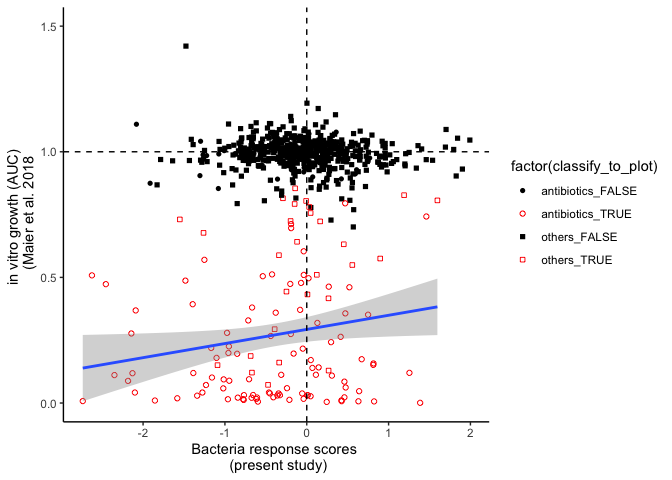
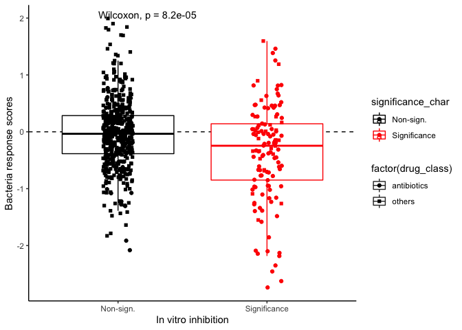

Publicly available data from the Maier et al., 2018 Nature (DOI: 10.1038/nature25979) can be downloaded from:  
https://figshare.com/articles/dataset/Extensive_impact_of_non-antibiotic_drugs_on_human_gut_bacteria/4813882  
Load *in vitro* data 


```r
combined_pv = read.csv("~/Desktop/Backup from server /backup_Oct2020/First rotation - VDB/Data - ASV/Aug2021/combined_pv.csv")
prestwick_atc = read_tsv("~/Desktop/Backup from server /backup_Oct2020/First rotation - VDB/Data - ASV/Aug2021/prestwick_atc.tsv")
```

```
## Rows: 3509 Columns: 11
## ── Column specification ────────────────────────────────────────────────────────
## Delimiter: "\t"
## chr (10): prestwick_ID, chemical_name, chemical_formula, cas_number, therape...
## dbl  (1): molecular_weight
## 
## ℹ Use `spec()` to retrieve the full column specification for this data.
## ℹ Specify the column types or set `show_col_types = FALSE` to quiet this message.
```

```r
species_overview = read_tsv("~/Desktop/Backup from server /backup_Oct2020/First rotation - VDB/Data - ASV/Aug2021/species_overview.tsv")
```

```
## Rows: 83 Columns: 8
## ── Column specification ────────────────────────────────────────────────────────
## Delimiter: "\t"
## chr (6): NT_code, species_name, specI_cluster, species, species_label, biosa...
## dbl (1): strain
## lgl (1): is_unique
## 
## ℹ Use `spec()` to retrieve the full column specification for this data.
## ℹ Specify the column types or set `show_col_types = FALSE` to quiet this message.
```


```r
tblcounts = read.csv("~/Desktop/Backup from server /backup_Oct2020/First rotation - VDB/Data - ASV/Sept7_rebuttal/deposited dataset/tblcounts_master_table_deid_MSKCC_9167_Duke_473_post_filter_102422.csv")
length(unique(tblcounts$oligos_id))
```

```
## [1] 9640
```

```r
length(unique(tblcounts$sampleid))
```

```
## [1] 9640
```

```r
tbleuclidean_distance = read.csv("~/Desktop/Backup from server /backup_Oct2020/First rotation - VDB/Data - ASV/Sept7_rebuttal/deposited dataset/tbleuclidean_distance_10clusters_post_filter_7454samples_102422.csv")

tbldrugs = read.csv("~/Desktop/Backup from server /backup_Oct2020/First rotation - VDB/Data - ASV/Sept7_rebuttal/deposited dataset/tbldrugs_master_table_MSKCC_1198patients_day-14to14_102422.csv")
length(unique(tbldrugs$PatientID))
```

```
## [1] 1198
```

```r
range(tbldrugs$exposure_day_relative_to_hct)
```

```
## [1] -14  14
```

```r
tblsample = read.csv("~/Desktop/Backup from server /backup_Oct2020/First rotation - VDB/Data - ASV/Sept7_rebuttal/deposited dataset/tblsample_cohort_master_table_deid_MSKCC_9167_Duke_473_post_filter_102422.csv")
tblsample_discovery = tblsample %>% 
  filter(set == "discovery")
dim(tblsample_discovery)
```

```
## [1] 7454   16
```


```r
self_coefficient_matrix = read.csv("~/Desktop/Backup from server /backup_Oct2020/First rotation - VDB/Data - ASV/Sept7_rebuttal/deposited dataset/tblself_coefficient_matrix_2039samples_102422.csv")

attractor_coefficient_matrix = read.csv("~/Desktop/Backup from server /backup_Oct2020/First rotation - VDB/Data - ASV/Sept7_rebuttal/deposited dataset/tblattractor_coefficient_matrix_2039samples_102422.csv")
```

We need to merge the tables together to obtain full drug names and species names, and match with the drug names in our *in silico* study. 


```r
maier_data = combined_pv %>% 
  left_join(prestwick_atc %>% select(prestwick_ID, chemical_name), by = "prestwick_ID") %>% 
  left_join(species_overview %>% select(NT_code, species), by = "NT_code") %>% 
  filter(!duplicated(.)) %>% 
  mutate(chemical_name = as.character(chemical_name)) %>% 
  mutate(chemical_name_matched = tolower(gsub(' [A-z ]*', '' , chemical_name)) ) %>% 
  mutate(chemical_name_matched = case_when(chemical_name == "Baclofen (R,S)" ~ "baclofen",
                                    chemical_name == "Methylprednisolone, 6-alpha" ~ "methylprednisolone", 
                                    chemical_name == "Metoprolol-(+,-) (+)-tartrate salt" ~ "metoprolol", 
                                    chemical_name == "Ethinylestradiol" ~ "estradiol",
                                    chemical_name == "Estradiol Valerate" ~ "estradiol valerate",
                                    chemical_name == "Cyclosporin A" ~ "cyclosporine", 
                                    chemical_name == "Amlodipine" ~ "amlodipine_besylate",
                                    TRUE ~ chemical_name_matched) )
```

Two antibiotics, piperacillin/tazobactam and sulfamethoxazole/trimethoprim, were administered in human as combination, but were screened *in vitro* individually. We assume that drugs given in combination in the clinical setting will have synergistic effect *in vitro*. 


```r
piptazo_synergy = maier_data %>% 
  filter(chemical_name_matched == "piperacillin") %>% 
  select(NT_code, species, AUC, hit) %>% 
  left_join(maier_data %>% filter(chemical_name_matched == "tazobactam") %>% select(NT_code, species, AUC, hit), by = "NT_code") %>% 
  mutate(AUC = AUC.x * AUC.y) %>% 
  mutate(hit.x = as.numeric(hit.x) ) %>% 
  mutate(hit.y = as.numeric(hit.y) ) %>% 
  mutate(hit = hit.x + hit.y) %>% 
  mutate(hit = case_when(hit >= 1 ~ T, T ~ F)) %>% 
  mutate(prestwick_ID = NA, pv_comb = NA, AUCsd = NA, fine = NA, n_repl = NA, pv_comb_fdr_BH = NA, CID_flat = NA, 
         target_species = "bacteria", veterinary = FALSE, human_use = TRUE, chemical_name = "piperacillin_tazobactam", 
         species = species.x, chemical_name_matched = "piperacillin_tazobactam") %>% 
  select(NT_code, prestwick_ID, pv_comb, AUC, AUCsd, fine, n_repl, pv_comb_fdr_BH, CID_flat, target_species, veterinary, human_use, 
         hit, chemical_name, species, chemical_name_matched)

sulfatrim_synergy = maier_data %>% 
  filter(chemical_name_matched == "sulfamethoxazole") %>% 
  select(NT_code, species, AUC, hit) %>% 
  left_join(maier_data %>% filter(chemical_name_matched == "trimethoprim") %>% select(NT_code, species, AUC, hit), by = "NT_code") %>% 
  mutate(AUC = AUC.x * AUC.y) %>% 
  mutate(hit.x = as.numeric(hit.x) ) %>% 
  mutate(hit.y = as.numeric(hit.y) ) %>% 
  mutate(hit = hit.x + hit.y)  %>% 
  mutate(hit = case_when(hit >= 1 ~ T, T ~ F)) %>% 
  mutate(prestwick_ID = NA, pv_comb = NA, AUCsd = NA, fine = NA, n_repl = NA, pv_comb_fdr_BH = NA, CID_flat = NA, 
         target_species = "bacteria", veterinary = FALSE, human_use = TRUE, chemical_name = "sulfamethoxazole_trimethoprim", 
         species = species.x, chemical_name_matched = "sulfamethoxazole_trimethoprim") %>% 
  select(NT_code, prestwick_ID, pv_comb, AUC, AUCsd, fine, n_repl, pv_comb_fdr_BH, CID_flat, target_species, veterinary, human_use, 
         hit, chemical_name, species, chemical_name_matched)

maier_data = rbind.data.frame(maier_data, piptazo_synergy, sulfatrim_synergy)
```

We removed one *E.coli* strain and one *B.fragilis* since there are two strains for each species screened *in vitro*. We filtered out the second strain, keeping only the first in terms of NT_code numbers.  


```r
maier_data$species = gsub(" ", ".\\", maier_data$species)
maier_data = maier_data %>% 
  filter(NT_code != "NT5078") %>% 
  filter(NT_code != "NT5033")
```

In order to calculate the species-specific response scores, we determined clusters' mean relative abundance for species present in both data sets. First, we determined the species relative abundance for samples in the MSKCC discovery cohort. 


```r
abundance_by_species = tblcounts %>% 
  filter(oligos_id %in% tblsample_discovery$oligos_id) %>% 
  group_by(oligos_id, species) %>% 
  summarise(.,total_frequency = sum(count/count_total)) %>% 
  spread(species, total_frequency, fill=0) 
```

```
## `summarise()` has grouped output by 'oligos_id'. You can override using the
## `.groups` argument.
```

```r
colnames(abundance_by_species) = gsub("\\]", "", colnames(abundance_by_species))
colnames(abundance_by_species) = gsub("\\[", "", colnames(abundance_by_species))
colnames(abundance_by_species)[-1] = gsub("_", ".", colnames(abundance_by_species)[-1])
```

We selected species with a minimum abundance threshold of 10^-4 and present in at least 10% of the samples, and calculated clusters' mean relative abundance. 


```r
select_sp <- function(fc){
  threshold = fc >= 10^-4
  threshold = factor(threshold, level = c(TRUE, FALSE))
  t_th = table(threshold)/sum(table(threshold))
  if (t_th[["TRUE"]] >= 0.1){
    return(TRUE)
  } else {
    return(FALSE)
  }
}

abundance_by_species_filtered = abundance_by_species %>% 
  left_join(tblsample_discovery %>% select(oligos_id, cluster_assignment), by = "oligos_id") %>% 
  select(oligos_id, match(unique(maier_data$species), colnames(abundance_by_species), nomatch=0), cluster_assignment) 

abundance_by_species_filtered = abundance_by_species_filtered[,c(1,which(apply(abundance_by_species_filtered[,-c(1,36)],2,select_sp) == TRUE) + 1, 36)]

species_profile_by_cluster = abundance_by_species_filtered [,-1] %>% 
  group_by(cluster_assignment) %>%
  summarise_all(mean) %>% 
  data.frame()

dim(species_profile_by_cluster)
```

```
## [1] 10 20
```

```r
microbiomeFeatureList_invivo = colnames(species_profile_by_cluster)[-1]
drugList_invivo = unique(tbldrugs$exposure_name)[which(unique(tbldrugs$exposure_name) %in% maier_data$chemical_name_matched)]

length(drugList_invivo)
```

```
## [1] 34
```

Altogether, there are 19 species and 34 drug exposures shared between the human data in this study, and the *in vitro* screening data. We could now calculate the species-specific response scores for this overlapped set. 


```r
response_score_invivo_comparison = data.frame(exposure_name = drugList_invivo) 

for (i in 1:length(microbiomeFeatureList_invivo)){
  
  feature_profile_by_cluster_i = species_profile_by_cluster[[i]]
  feature_profile_name = microbiomeFeatureList_invivo[i]
  
  response_score_aggregate = c() 
  
  for (drug in drugList_invivo){
    
    response_score = bacteria_response_score(self_coef = self_coefficient_matrix, 
                                             attractor_coef = attractor_coefficient_matrix, 
                                             exposure_name = drug,
                                             feature_profile_by_cluster = feature_profile_by_cluster_i, 
                                             euclidean_distance = tbleuclidean_distance, 
                                             d = 0, 
                                             numCluster = 10)
    
    
    response_score_aggregate = c(response_score_aggregate, response_score)
    
  }
  response_score_invivo_comparison[feature_profile_name] = response_score_aggregate
}

response_score_invivo_comparison_long = reshape2::melt(response_score_invivo_comparison, id = "exposure_name")
```

We compared the species-specific response scores with the area-under-curve (AUC) measurements of anti-bacterial activities for each investigated drug exposures, first by visualizing the raw data on a dot plot. 


```r
antibiotic_names = c("aztreonam", "cefepime", "ciprofloxacin", "meropenem", "metronidazole", "piperacillin_tazobactam",
                     "sulfamethoxazole_trimethoprim")

response_score_invivo_comparison_to_plot = response_score_invivo_comparison_long %>%
  select(exposure_name, species = variable, response_score = value) %>% 
  left_join(maier_data %>% select(exposure_name = chemical_name_matched,
                                  species = species,
                                  AUC = AUC, 
                                  hit = hit), by = c("exposure_name", "species") ) %>% 
  mutate(drug_class = case_when(exposure_name %in% antibiotic_names ~ "antibiotics", 
                                TRUE ~ "others")) %>% 
  mutate(significance_char = case_when(hit == TRUE ~ "Significance", 
                                       TRUE ~ "Non-sign.")) %>% 
  mutate(negative_score = case_when(response_score >= 0 ~ "positive", 
                                    TRUE ~ "negative")) %>% 
  mutate(classify_to_plot = paste(drug_class, hit, sep="_"))

ggplot(response_score_invivo_comparison_to_plot, aes(y = AUC, x = response_score)) + 
  geom_point(aes(col = factor(classify_to_plot), shape = factor(classify_to_plot))) + 
  geom_smooth(data = response_score_invivo_comparison_to_plot[response_score_invivo_comparison_to_plot$hit == T,], method = "lm") +
  scale_color_manual(values = c("black", "red", "black", "red")) +
  scale_shape_manual(values = c(16, 21, 15, 22)) +
  theme_classic() + 
  geom_hline(yintercept = 1, linetype = "dashed") + 
  geom_vline(xintercept = 0, linetype = "dashed") + 
  scale_y_continuous(limits = c(0,1.5)) +
  xlab("Bacteria response scores \n (present study)") +
  ylab("in vitro growth (AUC) \n (Maier et al. 2018")
```

```
## `geom_smooth()` using formula 'y ~ x'
```

<!-- -->

We observed a potential enrichment of significant *in vitro* hits (significant anti-bacteria activity of a given drug against a given species) in the lower left quadrant (with negative bacteria response scores), indicating that these species-drug interactions are also predicted to be inhibitory in this study. We can perform statistical test to validate this observation. 


```r
table(response_score_invivo_comparison_to_plot$hit, response_score_invivo_comparison_to_plot$negative_score)
```

```
##        
##         negative positive
##   FALSE      274      246
##   TRUE        82       44
```

```r
fisher.test( table(response_score_invivo_comparison_to_plot$hit, response_score_invivo_comparison_to_plot$negative_score) )
```

```
## 
## 	Fisher's Exact Test for Count Data
## 
## data:  table(response_score_invivo_comparison_to_plot$hit, response_score_invivo_comparison_to_plot$negative_score)
## p-value = 0.01266
## alternative hypothesis: true odds ratio is not equal to 1
## 95 percent confidence interval:
##  0.3888432 0.9110423
## sample estimates:
## odds ratio 
##  0.5981338
```

We wanted to compare the species-specific response scores between drugs that are significant *in vitro* hits, and drugs that are not significant *in vitro* hits. We observed that drugs that are significant *in vitro* hits have lower response scores compared to drugs that are not significant *in vitro* hits. 


```r
ggplot(response_score_invivo_comparison_to_plot, 
       aes(x = significance_char, y = response_score, group = significance_char, 
           col = significance_char, shape = factor(drug_class))) + 
  geom_hline(yintercept = 0, linetype = "dashed") +
  geom_boxplot(outlier.shape = NA) +
  geom_jitter(width = 0.1) +
  scale_color_manual(values = c("black", "red")) +
  scale_shape_manual(values = c("circle", "square")) +
  theme_classic() + stat_compare_means() +
  ylab("Bacteria response scores") +
  xlab("In vitro inhibition")
```

<!-- -->

We could perform T-test comparing the response scores between *in vitro* hits and non-hits to zero. The response scores for *in vitro* hits are significantly different from 0 and lower than zero, indicating inhibitory associations in this human dataset. 


```r
t.test(response_score_invivo_comparison_to_plot$response_score[response_score_invivo_comparison_to_plot$hit == T])
```

```
## 
## 	One Sample t-test
## 
## data:  response_score_invivo_comparison_to_plot$response_score[response_score_invivo_comparison_to_plot$hit == T]
## t = -4.8019, df = 125, p-value = 4.409e-06
## alternative hypothesis: true mean is not equal to 0
## 95 percent confidence interval:
##  -0.5222683 -0.2174088
## sample estimates:
##  mean of x 
## -0.3698385
```

```r
t.test(response_score_invivo_comparison_to_plot$response_score[response_score_invivo_comparison_to_plot$hit == F])
```

```
## 
## 	One Sample t-test
## 
## data:  response_score_invivo_comparison_to_plot$response_score[response_score_invivo_comparison_to_plot$hit == F]
## t = -1.2828, df = 519, p-value = 0.2001
## alternative hypothesis: true mean is not equal to 0
## 95 percent confidence interval:
##  -0.085105  0.017868
## sample estimates:
##  mean of x 
## -0.0336185
```
